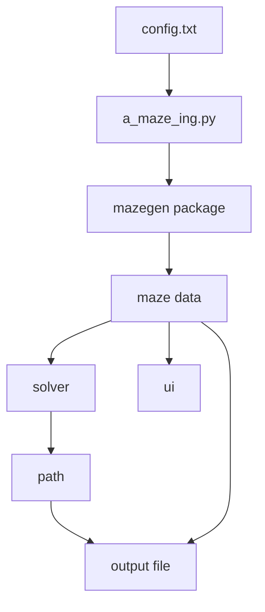
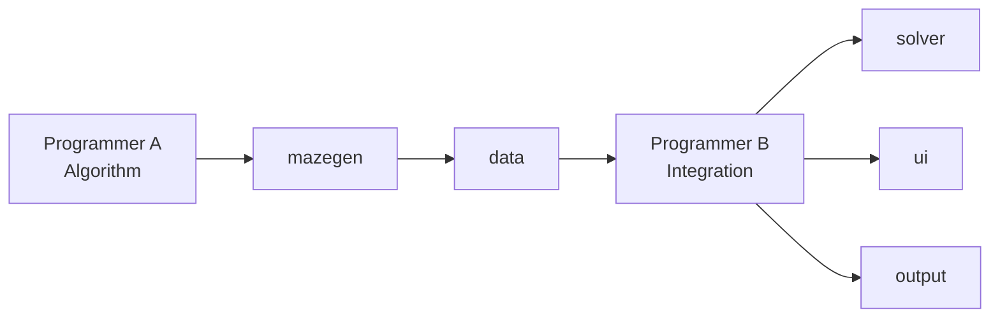

*This project has been created as part of the 42 curriculum by <login1>, <login2>.*

# A-Maze-ing

## Description

A-Maze-ing is a Python-based system that generates, solves, and visualizes mazes from a configuration file. The program ensures structural validity, supports perfect maze generation (unique path between entry and exit), computes the shortest path, and exports the result in a strict hexadecimal format. The architecture is modular, separating generation, solving, visualization, and orchestration.

---

## Architecture



The system is organized into independent components. The `mazegen` module handles generation, the solver computes paths, the UI renders the maze, and the main script coordinates all interactions.

---

## Instructions

### Run

```bash
python3 a_maze_ing.py config.txt
```

### Makefile

```bash
make install
make run
make debug
make clean
make lint
```

---

## Configuration File (Complete Structure)

The configuration file follows a strict `KEY=VALUE` format, where each line defines one parameter of the maze. Commented lines starting with `#` are ignored. The required keys are `WIDTH`, `HEIGHT`, `ENTRY`, `EXIT`, `OUTPUT_FILE`, and `PERFECT`. Coordinates are expressed as tuples (`x,y`), dimensions must be positive integers, and the `PERFECT` flag must be a boolean. The program validates all inputs and handles invalid configurations gracefully without crashing.

```ini
WIDTH=20
HEIGHT=15
ENTRY=0,0
EXIT=19,14
OUTPUT_FILE=output_maze.txt
PERFECT=True
```

---

## Maze Generation Algorithm

The project implements two maze generation algorithms: the Recursive Backtracker (DFS) and Prim’s Algorithm. The Recursive Backtracker explores the maze depth-first and produces long, corridor-like structures, while Prim’s Algorithm builds the maze by expanding a randomized frontier, resulting in more evenly distributed paths. The algorithm can be selected dynamically during execution.

---

## Why These Algorithms

These algorithms were chosen to illustrate different approaches to maze generation and to provide flexibility in the resulting structures. DFS offers simplicity and performance, while Prim’s Algorithm produces more balanced mazes. Supporting both allows comparison and demonstrates a deeper understanding of algorithmic design.

---

## Solver

The shortest path between entry and exit is computed in `solver/pathfinder.py`. The solver guarantees a valid shortest path and encodes it using the directions `N`, `E`, `S`, and `W`, ensuring consistency with the generated maze structure.

---

## Output Format

The output file contains the hexadecimal representation of the maze, followed by the entry and exit coordinates, and the computed shortest path. Each cell is encoded using bitwise wall representation, ensuring coherence between neighboring cells.

Example:

```
<maze grid>

1,1
19,14
NNEESSWW...
```

---

## Reusable Code

The maze generation logic is fully encapsulated in the `mazegen` package, which is independent from the solver and user interface. This module can be packaged as a `.whl` file and reused in other projects. It exposes a simple interface for generating mazes with configurable parameters such as size, seed, and algorithm, making it suitable for integration in different environments.

```python
from mazegen import MazeGenerator

gen = MazeGenerator(width=10, height=10, seed=42)
maze = gen.generate()
```

---

## Features

The project supports multiple generation algorithms, perfect maze generation, deterministic output via seed, shortest path computation, and both terminal and graphical visualization. It also includes interactive controls such as regenerating the maze, toggling the solution path, and adjusting display properties like colors.

---

## Team & Project Management



### Roles

The project was developed collaboratively with a clear separation of responsibilities. Programmer A focused on the core logic, implementing the maze generation algorithms, bitwise wall encoding, and the reusable `mazegen` module. Programmer B handled integration aspects, including configuration parsing, solver implementation, visualization (terminal and graphical), and output formatting.

### Planning and Evolution

The project started with a minimal generator implementation and progressively evolved through integration phases. After establishing the core logic, the solver and output format were added, followed by visualization and interaction features. Finally, support for multiple algorithms and additional refinements were introduced.

### What Worked Well / Improvements

The modular structure and clear separation of concerns allowed efficient collaboration and integration. The reusable design proved effective and scalable. However, improvements could be made by adding more generation algorithms, enhancing the graphical interface, and optimizing performance for larger mazes.

### Tools Used

The project was developed using Python 3.10+, with `flake8` for linting and `mypy` for static type checking. A Makefile was used to automate common tasks such as running, debugging, and validating the project.

---

## Resources

### References

The project is based on classical maze generation and graph theory concepts, including Recursive Backtracking (DFS), Prim’s Algorithm, and shortest path computation using graph traversal techniques.

### AI Usage

AI tools were used to assist with structuring documentation, validating architectural decisions, and refining explanations. All generated content was reviewed, tested, and fully understood before integration.

---

## Conclusion

This project demonstrates a complete pipeline from configuration parsing to maze generation, solving, visualization, and export. It highlights modular design, algorithmic understanding, and practical software engineering in Python.